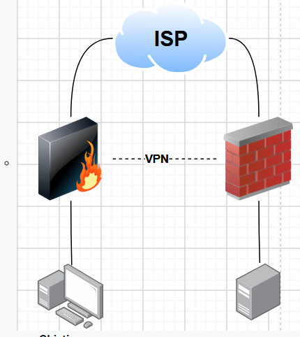

# Práctica 2 — VPN site-to-site (Infraestructura 2)

## Objetivo

Comunicar el equipo de usuario con el servidor web a través de un túnel VPN site-to-site y comprobar que el tráfico entre ambas redes deja de pasar cuando el túnel está inactivo.

## Topología propuesta

El diagrama representa los componentes solicitados: un FortiGate, un peer de red del otro lado, un ISP que proporciona conectividad entre sus direcciones públicas, una red de usuario y una red de servidor. El equipo peer puede ser Cisco u otro fabricante compatible con IPsec.

## Requisitos de la práctica

- Configurar las interfaces y redes de ambos peers.
- Configurar NAT donde corresponda para la salida hacia el ISP; el tráfico protegido por el túnel debe conservar las direcciones privadas y no recibir NAT.
- Establecer el túnel IPsec site-to-site entre los peers.
- Publicar el servidor web por HTTPS en una subred `/28`.
- Conectar los usuarios a una subred `/25`, con VLAN 10 y DHCP.
- Verificar el acceso usuario-servidor con el túnel activo y repetir la prueba con el túnel desactivado.
- Ejecutar traceroute desde el equipo de usuario hacia el servidor.
- Realizar la configuración y la demostración del FortiGate mediante su GUI.

## Direccionamiento

El plan de direccionamiento debe asignarse según la matrícula y las redes disponibles en el laboratorio. No se fija aquí ningún bloque ni dirección pública para evitar documentar valores que no hayan sido confirmados para esta infraestructura.

## Estado de la evidencia

La imagen incluida es el diagrama de referencia de la práctica. Por sí sola no demuestra que el túnel, el acceso HTTPS, DHCP, NAT o traceroute estén funcionando. Añade capturas de la GUI y salidas de las pruebas cuando se complete y verifique esta infraestructura.

## Evidencias recomendadas para completar el repositorio

1. Interfaces y direccionamiento de los peers.
2. Estado del túnel IPsec y contadores de tráfico.
3. Políticas de firewall y NAT.
4. Concesión DHCP del usuario en VLAN 10.
5. Acceso HTTPS al servidor con el túnel activo.
6. Fallo de la comunicación protegida con el túnel inactivo y recuperación al volver a activarlo.
7. Traceroute hacia la dirección del servidor.

No incluir claves precompartidas, contraseñas ni capturas que las muestren.
